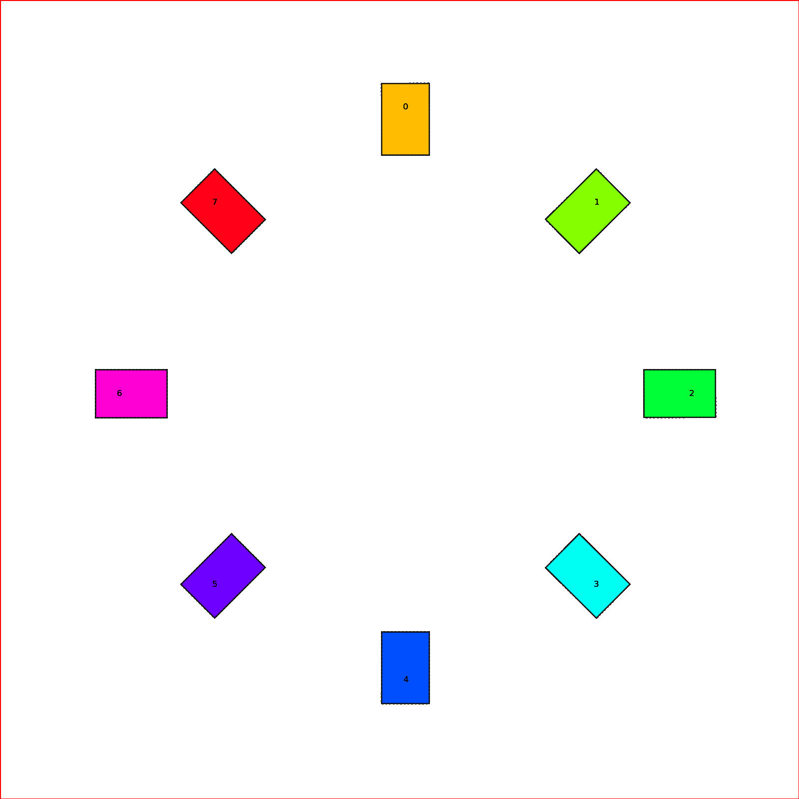

# CL-CBS

## Overview

**Car-Like Conflict Based Search (CL-CBS)** is an efficient and complete solver of Multi-Agent Path Finding for Car-like Robots problem. It applies a body conflict tree to address collisions considering the shape of agents. It also includes a new algorithm Spatiotemporal Hybrid-State A* as the single-agent path planner to generate path satisfying both kinematic and spatiotemporal constraints.



## **Source Code**

The source code of CL-CBS will be released soon.

## Benchmark

Benchmark for evaluating CL-MAPF problem are available in `benchmark` folder. It contains 3000 unique instances with different map size and agents number.

The folder are arranged like follows, each mapset contains 60 instances:

```
benchmark
├── map100by100
│   ├── agents10
│   │   ├── empty
│   │   └── obstacle
│   ...
├── map300by300
│   ├── agents10
│   │   ├── empty
│   │   └── obstacle
│   ...
└── map50by50
    ├── agents10
    │   ├── empty
    │   └── obstacle
    ...
```

The instance are in `yaml` format.

A typical result from benchmark acts like below:


## Credits 

This code was developed by the  [APRIL Lab](https://github.com/APRIL-ZJU) in Zhejiang University.

For researchers that have leveraged or compared to this work, please cite the following:

Licheng Wen, Zhen Zhang, Zhe Chen, Xiangrui Zhao, and Yong Liu. CL-MAPF: Multi-Agent Path Finding for Car-Like Robots with Kinematic and Spatiotemporal Constraints.[[arxiv](https://arxiv.org/abs/2011.00441)]

## License

The code is provided under the [MIT License](https://opensource.org/licenses/MIT).